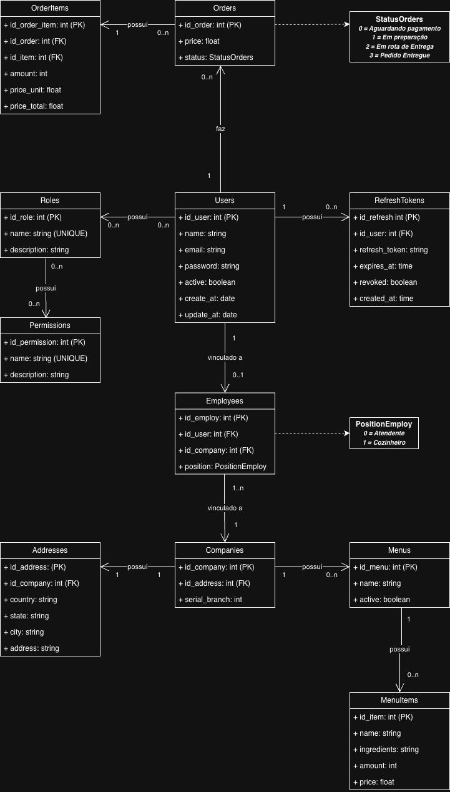

# Raizes do Nordeste

Curso: CST ANÁLISE E DESENVOLVIMENTO DE SISTEMAS.

Trabalho: Raízes do Nordeste

Descrição: 
Este projeto consiste em uma pequena API, desenvolvida em Python com FastAPI, estruturada em Clean Architecture e integrando banco de dados Postgress.

## REQUISITOS
- Python 3.14.3
- psql (PostgreSQL) 18.3

## 1. Instalação

### Criar .venv
Mac/Linux:
```bash
python3 -m venv .venv
```
Windows:
```bash
python -m venv .venv
```

### Ativar .venv
Mac/Linux:
```bash
source .venv/bin/activate
```
Windows:
```bash
.venv\Scripts\Activate.ps1
```

### Instalar depêndencias
```bash
pip install -r requirements.txt
```

## 2. Executar
Antes de executar, crie um arquivo .env na raiz do projeto, com as variáveis de ambiente necessárias. Exemplo:
```text
DATABASE_URL=conection_string_aqui

JWT_SECRET_KEY=sua_chave_secreta_aqui
JWT_ALGORITHM=HS256
JWT_EXPIRE_MINUTES=60
```

Em seguida, execute a API com o comando:
```bash
python3 run.py
```

Para acessar a documentação detalhada, acesse: 
<a link="localhost:4201/docs">localhost:4201/docs</a>

## 3. Banco de Dados Postgress

Diagrama inicial do Banco:

</img>

Comandos para criar o banco, no modelo compatível com a versão atual do projeto:
```sql
CREATE TYPE status_orders AS ENUM (
    'AGUARDANDO_PAGAMENTO',
    'EM_PREPARACAO',
    'EM_ROTA_ENTREGA',
    'PEDIDO_ENTREGUE'
);

CREATE TYPE position_employ AS ENUM (
    'GERENTE',
	'ATENDENTE',
    'COZINHEIRO'
);

CREATE TABLE users (
    id_user SERIAL PRIMARY KEY,
    name VARCHAR(255) NOT NULL,
    email VARCHAR(255) NOT NULL UNIQUE,
    password VARCHAR(255) NOT NULL,
    active BOOLEAN NOT NULL DEFAULT TRUE,
    create_at DATE NOT NULL DEFAULT CURRENT_DATE,
    update_at DATE
);

CREATE TABLE roles (
    id_role SERIAL PRIMARY KEY,
    name VARCHAR(100) NOT NULL UNIQUE,
    description TEXT
);

CREATE TABLE permissions (
    id_permission SERIAL PRIMARY KEY,
    name VARCHAR(100) NOT NULL UNIQUE,
    description TEXT
);

CREATE TABLE companies (
    id_company SERIAL PRIMARY KEY,
    serial_branch INT NOT NULL
);

CREATE TABLE addresses (
    id_address SERIAL PRIMARY KEY,
    id_company INT NOT NULL UNIQUE,
    country VARCHAR(100) NOT NULL,
    state VARCHAR(100) NOT NULL,
    city VARCHAR(100) NOT NULL,
    address VARCHAR(255) NOT NULL,

    CONSTRAINT fk_addresses_companies
        FOREIGN KEY (id_company)
        REFERENCES companies(id_company)
        ON DELETE CASCADE
);

CREATE TABLE employees (
    id_employ SERIAL PRIMARY KEY,
    id_user INT NOT NULL UNIQUE,
    id_company INT NOT NULL,
    position position_employ NOT NULL,

    CONSTRAINT fk_employees_users
        FOREIGN KEY (id_user)
        REFERENCES users(id_user)
        ON DELETE CASCADE,

    CONSTRAINT fk_employees_companies
        FOREIGN KEY (id_company)
        REFERENCES companies(id_company)
        ON DELETE CASCADE
);

CREATE TABLE menus (
    id_menu SERIAL PRIMARY KEY,
    id_company INT NOT NULL,
    name VARCHAR(255) NOT NULL,
    active BOOLEAN NOT NULL DEFAULT TRUE,

    CONSTRAINT fk_menus_companies
        FOREIGN KEY (id_company)
        REFERENCES companies(id_company)
        ON DELETE CASCADE
);

CREATE TABLE menuitems (
    id_item SERIAL PRIMARY KEY,
    id_menu INT NOT NULL,
    name VARCHAR(255) NOT NULL,
    ingredients TEXT,
    amount INT NOT NULL,
    price NUMERIC(10,2) NOT NULL,

    CONSTRAINT fk_menuitems_menus
        FOREIGN KEY (id_menu)
        REFERENCES menus(id_menu)
        ON DELETE CASCADE
);

CREATE TABLE orders (
    id_order SERIAL PRIMARY KEY,
    id_user INT NOT NULL,
    price NUMERIC(10,2) NOT NULL,
    status status_orders NOT NULL DEFAULT 'AGUARDANDO_PAGAMENTO',

    CONSTRAINT fk_orders_users
        FOREIGN KEY (id_user)
        REFERENCES users(id_user)
        ON DELETE CASCADE
);

CREATE TABLE orderitems (
    id_order_item SERIAL PRIMARY KEY,
    id_order INT NOT NULL,
    id_item INT NOT NULL,
    amount INT NOT NULL,
    price_unit NUMERIC(10,2) NOT NULL,
    price_total NUMERIC(10,2) NOT NULL,

    CONSTRAINT fk_orderitems_orders
        FOREIGN KEY (id_order)
        REFERENCES orders(id_order)
        ON DELETE CASCADE,

    CONSTRAINT fk_orderitems_menuitems
        FOREIGN KEY (id_item)
        REFERENCES menuitems(id_item)
);

CREATE TABLE refreshtokens (
    id_refresh SERIAL PRIMARY KEY,
    id_user INT NOT NULL,
    refresh_token TEXT NOT NULL UNIQUE,
    expires_at TIME NOT NULL,
    revoked BOOLEAN NOT NULL DEFAULT FALSE,
    created_at TIME NOT NULL DEFAULT CURRENT_TIME,

    CONSTRAINT fk_refreshtokens_users
        FOREIGN KEY (id_user)
        REFERENCES users(id_user)
        ON DELETE CASCADE
);

CREATE TABLE users_roles (
    id_user INT NOT NULL,
    id_role INT NOT NULL,

    PRIMARY KEY (id_user, id_role),

    CONSTRAINT fk_users_roles_users
        FOREIGN KEY (id_user)
        REFERENCES users(id_user)
        ON DELETE CASCADE,

    CONSTRAINT fk_users_roles_roles
        FOREIGN KEY (id_role)
        REFERENCES roles(id_role)
        ON DELETE CASCADE
);

CREATE TABLE roles_permissions (
    id_role INT NOT NULL,
    id_permission INT NOT NULL,

    PRIMARY KEY (id_role, id_permission),

    CONSTRAINT fk_roles_permissions_roles
        FOREIGN KEY (id_role)
        REFERENCES roles(id_role)
        ON DELETE CASCADE,

    CONSTRAINT fk_roles_permissions_permissions
        FOREIGN KEY (id_permission)
        REFERENCES permissions(id_permission)
        ON DELETE CASCADE
);
```